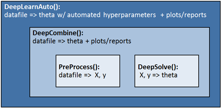

# VERSATILE NEURAL NETWORK SOLVER (VNNS)
[__VNNS__](https://nbviewer.jupyter.org/github/Akarvardar/VERSATILE_NEURAL_NETWORK_SOLVER/blob/master/vnns.ipynb) is a neural network solver written in Python 3.5. Key features of the code, its organization, the content of the example notebooks, and the datasets used to generate the examples were explained in the following.

_For best readability, it is recommended to open the notebooks in this repository under nbviewer using the links embedded in this file rather than rendering them under Github. Also, Chrome is the browser of choice._

## Key features
The primary function of VNNS is to find out the optimal set of hyperparameters for a particular classification problem and then calculate the network parameters using those hyperparameters. VNNS seeks to minimize the user effort across the entire classification process, from the pre-processing of a .csv datafile to achieving a robust model along with the associated training and test scores. Model accuracy and simplicity are co-optimized in VNNS. 

Specific capabilities: 
- Pre-processes the raw input data,
- Accommodates datasets with any number of classes,
- Computes parameters for networks featuring arbitrarily high number of hidden layers and units in each layer,
- Combines polynomial regression and neural nets to achieve sophisticated models,
- Leverages a custom gradient descent implementation as well as the built-in scipy minimization algorithms to solve the network parameters, 
- Makes predictions based on calculated network parameters and reports the training and test accuracies,
- Features many plotting and reporting functions to reveal the details associated with calculations,
- Sets automatically the optimal values for key hyperparameters :  
    - Learning-rate (alpha) for gradient descent,
    - Degree for polynomial expansion,
    - Hidden unit configuration,
    - Regularization parameter (lambda.)
    
## Script organization
 VNNS is made of four classes:
 - __PreProcess()__: Processes the raw input data and makes the feature matrix (X) and target vector (y) ready in their final form for the solver.
 - __DeepSolve()__: Starting with a feature matrix and target vector, computes the network parameters (theta) together with prediction and scoring capabilities.
 - __DeepCombine()__: Combines classes PreProcess() and DeepSolve() and complements them with plotting and report generating functions.
 - __DeepLearnAuto()__: Augments the capabilities of class DeepCombine() by automated tuning of polynomial degree, hidden-unit configuration, and regularization parameter lamda. 

VNNS class organization is schematized below:

  

The modularity of VNNS is such that, if needed, users can easily modify the algorithms, for instance those used in optimal hyperparameter search, without disturbing high level workings of the script.

## Example Notebooks
In order to illustrate what VNNS is capable of, we have eight notebooks (NB00 to NB07) showing solutions for datafiles grouped in three folders depending on their size.  
The first five notebooks (__NB00 to NB04__) provide results on the 15 datasets with "medium" complexity. The strategy in these five notebooks is to: 
- Start with the simplest network in NB00, 
- Compute the classification models for all datasets, 
- Separate out the datasets into two groups depending on whether their model is "satisfactory" or not. The criterion we use for this categorization is the sum of training and test scores (each between 0 and 1) being higher than 1.8. This is an arbitrary threshold which proved to be convenient. 
- Move the datasets for which the current network has not been able to provide a satisfactory model to the next notebook where the network configuration is made gradually more complex.   
- Repeat this until NB04.

In addition to examplifying how VNNS performs on nets with increased size, this particular strategy also allows to comprehend how increased number of hidden layers/units enables more sophisticated models that are required for rather complex datasets.   
Focus of __NB05__ is the comparison of different minimization algorithms. While NB00 to NB04 employs a custom implementation of gradient descent (GD), NB05 compares GD with the scipy's built-in algorithms TNC, SLSQP, CG, BFGS, and L-BFGS-B.   
__NB06__ is meant to give an idea on how VNNS, and more specifically its different minimization algorithms, perform against relatively large datasets with high number of samples, features, and number of classes. 
  
__NB07__ is an Appendix, providing basic examples on individual methods associated with the four classess forming VNNS. The intent of NB07 is to facilitate the understanding of VNNS details. 

__Detailed outline of the example notebooks:__
- [__NB00__](https://nbviewer.jupyter.org/github/Akarvardar/VERSATILE_NEURAL_NETWORK_SOLVER/blob/master/NB00.ipynb): Network with no hidden layers (logistic regression)
- [__NB01__](https://nbviewer.jupyter.org/github/Akarvardar/VERSATILE_NEURAL_NETWORK_SOLVER/blob/master/NB01.ipynb): Network with one hidden layer
- [__NB02__](https://nbviewer.jupyter.org/github/Akarvardar/VERSATILE_NEURAL_NETWORK_SOLVER/blob/master/NB02.ipynb): Network with two hidden layers
- [__NB03__](https://nbviewer.jupyter.org/github/Akarvardar/VERSATILE_NEURAL_NETWORK_SOLVER/blob/master/NB03.ipynb): Network with three hidden layers
- [__NB04__](https://nbviewer.jupyter.org/github/Akarvardar/VERSATILE_NEURAL_NETWORK_SOLVER/blob/master/NB04.ipynb): Network with three hidden layers combined with polynomial regression
- [__NB05__](https://nbviewer.jupyter.org/github/Akarvardar/VERSATILE_NEURAL_NETWORK_SOLVER/blob/master/NB05.ipynb): Network with three hidden layers, alternative algorithms
- [__NB06__](https://nbviewer.jupyter.org/github/Akarvardar/VERSATILE_NEURAL_NETWORK_SOLVER/blob/master/NB06.ipynb): Handling big datafiles
- [__NB07__](https://nbviewer.jupyter.org/github/Akarvardar/VERSATILE_NEURAL_NETWORK_SOLVER/blob/master/NB07.ipynb): Appendix - Simple examples on individual methods

## Datasets
The datasets we will be using in the example notebooks are listed below along with their number of samples, features, and classes. We have three sets of data ("Small", "Medium", and "Big") grouped in three different folders under folder "Data" based on the file sizes.  For "Medium" and "Big" files, independent test files are available along with the training files. In most instances, the number of samples in the test files is about the quarter of those in the training files:

  

- __"Medium"__ files are those we will use the most heavily in the example notebooks. In this set of files, the number of features is equal to 2, hence it is possible to visualize the decision boundary and overlay it with scatter plots. The files have varying complexity as suggested by the filenames. Three of the files have more than 2 classes. Number of samples varies from around 100 to a few 100. Below the scatter plots for the 15 "Medium" files are shown and different classes were distinguished with different colors. 

  

- __"Big"__ files are typically distinguished by their very high number of features. In addition, two of the files feature number of classes up to 6 and 10. Also the number of samples is above 1000 for two of the files. "Big" files were only used in NB06 and NB07. This particular folder, unlike the folders Medium and Small, could not be uploaded under Data folder due to its size.
  
- __"Small"__ files have typically less than 10 samples and they were used only in NB07 to explain some of the methods of class PreProcess().

## Acknowledgments
- Andrew Ng's Machine Learning Course and Deep Learning Specialization in Coursera have been by far the most useful resources to put together VNNS. Many datasets from those courses were also used to demo VNNS.
- Sebastian Raschka's book, Python Machine Learning. Also acknowledged for its datasets along with those from scikit-learn.
- Eric Matthews' book, Python Crash Course: A Hands-On, Project-Based Introduction to Programming.
